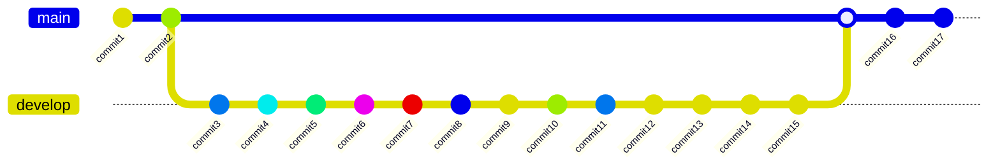
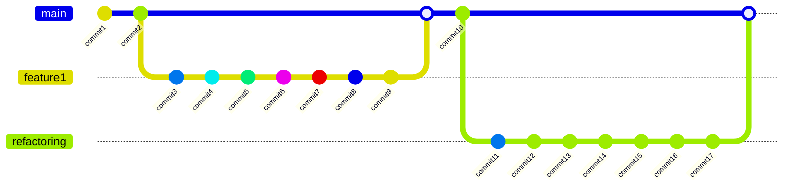

# Reflection talk DD-MM-YYYY template
---
## What went good in last year? ✅
---

### features/bugfixes ✨🐛

- conversion of EML/MSG files to PDFs
- integrating Textract as a text recognition service
- fixing Google OCR bugs
- splitting documents
- updating READMEs, refactoring

---

### infrastructure/architecture 🚀🏗

- Sonarqube clean-up for the audit commission
- Sonarlint coupling to Sonarqube lightning talk
- built C4 diagram

---

## What went bad in the last year? 😭

- tasks took longer than I expected
- team was busy, so couldn't always review my stuff properly
- sometimes the others had to finish my work
- sometimes I lose focus and refactor more than needed
    * [Nobody Ever Gets Credit for Fixing Problems that Never Happened](https://web.mit.edu/nelsonr/www/Repenning=Sterman_CMR_su01_.pdf)
      ![[productivity chart.png]]

---

### refactoring + implementation

---

### refa ctoring and implementation separate tickets

---

## What can we improve? 🚀

- Learning S3/DynamoDB/State machine in details
- Finishing the C4 diagram
- Work together with John towards improving internal procedures/architecture etc.

---

## What actions can we take? 📌

* ...

---

## Sidenotes 📚

Zen mode on TV: `Fn + F8`
Presentation mode on TV: `Fn + F9`